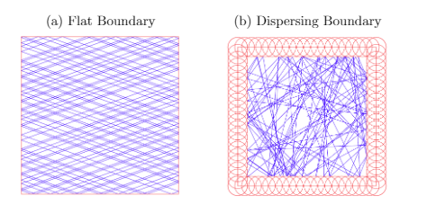

My name is Rares Cristian, and I am a fourth year undergraduate student at Georgia Institute of Technology.

# Research 

### Deterministic Volume Approximation of Polytopes

Computing the volume of a convex body has been a long-studied question, important from both a theoretical and practical perspective. A key aspect of the problem lies in the representation of the set. In the most general case, access to the set is provided solely through an oracle. However, given only a well-guaranteed separation oracle, no deterministic polynomial-time algorithm can approximate the volume to within a factor exponential in the dimension. However, access to an explicit description of the set removes this obstacle. As such, we restrict our attention to computing the volume of polytopes, which are expressed as the intersection of halfspaces.

Surprisingly, there do exist efficient randomized algorithms to compute volume given only an oracle. The problem has essentially been reduced to sampling uniformly from the interior of the polytope.

We investigate whether the notion of chaos can serve as a substitute for randomness in this setting. Given the initial state of a system, we cannot predict the future state of a random process. On the other hand, a chaotic one is fully deterministic. But this process is sensitive to initial conditions: any small change in initial conditions will result in vastly different orbits. 

In particular, we consider the orbit created by the free motion of a point particle inside the polytope with mirror-like reflections off the boundary. Figure (a) depicts the trajectory of a point particle in a square. However this system is not chaotic as translating the initial point will result in largely the same result. To remedy this, we introduce an inward curvature to the boundary. Figure (b) depicts the trajectory of the same initial point, only with circles placed around the boundary.

For more details on the reduction from volume to sampling and chaos and billiards, see [here](https://raresc21.github.io/Profile/pdf/Deterministic_Volume_Approximation.pdf)

### Range Queries

Range queries are a fundamental operation used in many applications, especially as database queries. Here, we restrict ourselves to queries on a static, one-dimensional array, X. A classic example includes finding the minimum entry in a contiguous subarray. More generally, we are given some fixed function f, and a sequence of queries (l,r) to compute f(X[l], X[l+1], ..., X[r]). Most data structures preprocess the array to determine the value of f for a particular subset P of ranges. To answer any query, they simply merge the solutions from a subset of precomputed ranges in P. 

For instance, consider the range sum problem. Here, the function f simply takes the sum of its inputs. We may compute the sum of all prefixes of the array: P[i] = X[1] + X[2] + ... + X[i]. Then, given a query (l,r) the answer is simply P[r] - P[l-1]. This partitioning scheme makes use of the fact that summation has an inverse: subtraction. We are interested in a broader class of functions. To answer any query (l,r) we are only allowed to use precomputed ranges which form a partition of (l,r). This allows for functions such as min, max, gcd, and various others. See the paper below for more details.

I have worked on finding better partitioning schemes. Given an array of length n, we require O(n log n) preprocessing time to compute solutions to various ranges, and O(1) time to answer any query afterwards. More [details](https://raresc21.github.io/Profile/pdf/Range_Queries.pdf), and an [implementation](https://github.com/RaresC21/Data-Structures/blob/master/NovelRangeQuery/NovelRangeQuery.cpp).

# Teaching

I have had the pleasure of being a teaching assistant for the Algorithms and Data Structures classes at GaTech (CS 3510, CS 3511).

### Programming Team

I have given several lectures at Georgia Tech's programming team on advanced algorithms and data structures in preparation for programming contests, and the International Collegiate Programming Contest (ICPC) in particular. I have given lectures on topics such as

1. Topological Sort
2. Segment Trees - [slides](https://raresc21.github.io/Profile/pdf/segment_tree.pdf)
3. DP Optimization using convex envelopes of linear functions
4. Geometry - Triangulation, Convex Hull

### Theory Club 

I have presented an introductory talk at Georgia Tech's undergrad Theory Club on Ergodic Theory, specifically in the setting of chaotic dynamical systems. Slides can be found [here](https://raresc21.github.io/Profile/pdf/IntroductionErgodicTheory.pdf). It includes 

1. Chaos
- Examples, Logistic Family
- Lyapunov Exponents, Hyperbolicity
- Shadowing, Proof for contractions
2. Ergodic Theory
- Birkhoff Ergodic Theorem
- Transfer Operator
- Mixing, Decay of Correlations
